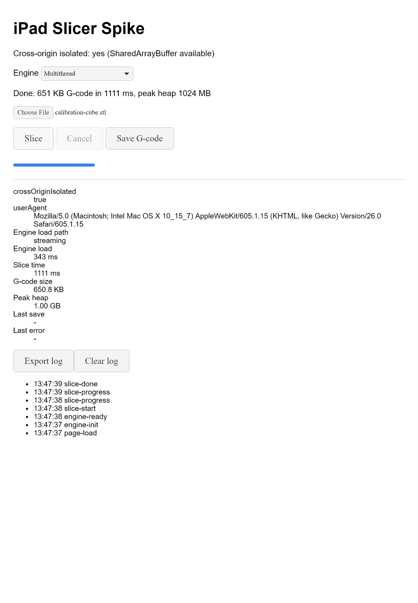
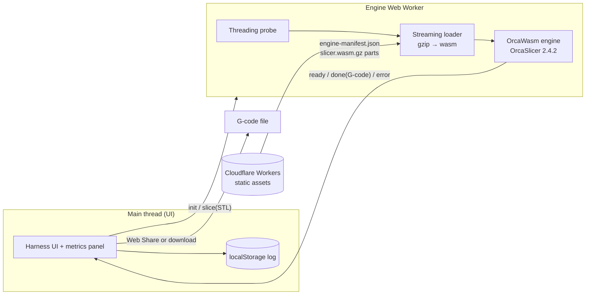

# iPad Slicer

A free, touch-first 3D printing slicer for the iPad, built on the real OrcaSlicer engine compiled to WebAssembly and running entirely in Safari — no server, no account, no upload.

> **Status: technical spike, verified in WebKit, not yet tested on a physical iPad.**
> This repository is the feasibility phase. Before designing any UI, the goal was to prove the risky part first: that OrcaSlicer's C++ engine can slice a real model inside a browser tab on iPad-class constraints and hand the user a usable G-code file. The current page is a measurement harness, not the final app.



---

## At a glance

| | |
| --- | --- |
| **What works today** | Load OrcaSlicer 2.4.2 (via OrcaWasm) in a Web Worker, slice an STL with a real Ender-3 V2 + PLA profile, save the G-code, measure load/slice/memory, cancel |
| **Engine variants** | Single-thread, and multithread with a fixed 1 GiB shared memory |
| **Verified in** | Node (headless engine check) and Playwright WebKit (Safari's engine) |
| **Stack** | TypeScript, Vite, Web Workers, WebAssembly, Vitest, Cloudflare Workers (static assets) |
| **Tests** | 117 unit tests + a real-engine slice check in Node + WebKit end-to-end smoke and model-size ladder runs |
| **License** | AGPL-3.0 (inherited from OrcaSlicer) |

---

## Why this project exists

Slicing — turning a 3D model into the G-code a printer runs — is still essentially a desktop-only job. The iPad is a capable device, but when I looked for a way to slice on it, nothing was **free, good, and easy to use** at the same time:

- desktop slicers (OrcaSlicer, PrusaSlicer, Cura) don't run on iPadOS;
- there are browser slicers, and some even use OrcaSlicer's engine, but their interfaces are dense, mouse-first, and feel old on a touch screen;
- the most promising OrcaSlicer-in-the-browser demo I found no longer loads at all.

So the idea is simple: **keep the engine people already trust, and rebuild the experience for touch.** OrcaSlicer is open source, and community projects already compile its core to WebAssembly. What's missing is an iPad-first product around it.

That idea has an obvious risk: a slicer is heavy C++ code that assumes a desktop — lots of memory, threads, a filesystem. Safari on an iPad gives a web page far less of all three. Building a nice UI on top of an engine that crashes on the device would be wasted work. **That's why this repo starts with a spike.**

---

## What the spike proved

| Question | Answer | Evidence |
| --- | --- | --- |
| Can OrcaSlicer's engine run in a browser worker? | **Yes** | WebKit loads the engine with streaming compilation in ~300–600 ms |
| Does it produce correct G-code? | **Yes** | A 20 mm cube → 292,819 bytes, 100 layers, Marlin start sequence, 220 °C nozzle, 60 °C bed |
| Is the 38 MB engine too big to host for free? | **No** | gzip brings it to ~9 MB, streamed and decompressed in the worker |
| Does multithreading work in Safari's engine? | **Yes, with fixed memory** | Identical G-code; **~40% faster** than single-thread in WebKit on 1–20 MB test models |
| Does it handle large models? | **Yes, on desktop WebKit** | A generated 50 MB STL slices in ~13 s (multithread) with no crash |
| Can the user get the file out? | **Yes (download path)** | Web Share first, download fallback; the saved file matches the G-code byte for byte |
| Is it safe to restart the engine? | **Not always** | Found a WebKit crash — see [What broke](#what-broke-and-what-we-learned) |
| Does it hold up on a real iPad? | **Not tested yet** | Next step: deploy and run the measurement matrix on device |

---

## How it works



1. **Build time** — `scripts/fetch-engine.mjs` downloads the pinned OrcaWasm release, checks every byte against SHA-256 hashes in `engine.lock.json`, gzips the wasm, splits it into ≤20 MiB parts, and writes a manifest.
2. **Engine start** — the worker probes whether the page is cross-origin isolated and can allocate shared memory, picks single-thread or multithread, streams the gzip parts through `DecompressionStream`, and compiles them with `WebAssembly.instantiateStreaming`.
3. **Profile** — the engine is initialized with a flat JSON config resolved from OrcaSlicer's own printer, process, and filament presets.
4. **Slice** — the STL is copied into the engine's memory; the resulting G-code is copied out and transferred back to the page.
5. **Save** — the Save button calls `navigator.share({ files })` synchronously inside the tap (Safari requires it) and falls back to a download link.
6. **Measure** — every event lands in a persistent log and a panel shows load path, timings, G-code size, and memory, exportable as JSON.

---

## Key technical decisions

| Decision | Choice | Why |
| --- | --- | --- |
| Engine | [OrcaWasm](https://github.com/Hiosdra/OrcaWasm) (OrcaSlicer 2.4.2 → WebAssembly) | Newest upstream version, active releases, documented C API with cancel support, both single- and multithread builds |
| Where slicing runs | Client-side, in a Web Worker | Free to operate (no servers), private (models never leave the device), keeps the UI responsive |
| Native iOS app | Rejected (for now) | AGPL and App Store terms don't mix well, and it costs a developer fee; a web app reaches the iPad without either |
| Hosting | Cloudflare Workers static assets | Free static hosting, supports the COOP/COEP headers multithreading needs, per-branch preview URLs for device testing |
| 25 MiB per-file hosting limit | Gzip + split + stream | The 38 MB wasm becomes one ~9 MB part; streaming keeps compile fast and avoids doubling memory |
| Printer profile | Resolve OrcaSlicer's preset inheritance into flat JSON | The engine accepts `orca.native-json`; no desktop app needed, and it's verifiable in Node |
| Multithread memory | Fixed 1 GiB shared memory (initial = maximum) | Growable shared memory + threads is a known crash on recent iPadOS |
| Supply chain | Engine binaries pinned by SHA-256, never committed | Reproducible builds, small repo, tamper detection |

---

## What broke, and what we learned

The most useful part of a spike is what it catches early. These are the problems that would have been expensive to discover after building a UI.

**1. The profile was wrong in a way only the real engine could tell.**
The first real slice failed: *"G92 E0 was found in before_layer_change_gcode, which is incompatible with absolute extruder addressing."* Two causes: OrcaSlicer resolves preset inheritance inside each vendor's folder first (Creality ships its own base presets — the generic ones were the wrong parents), and the Creality start G-code switches to relative extrusion without the matching setting. A headless Node check caught it before any browser was involved.

**2. "Isolated" in the test harness wasn't isolated.**
Multithreading needs `crossOriginIsolated`. The first WebKit harness said it was off even with the right headers. It turned out Playwright's request interception doesn't grant isolation; a real HTTP server does — and then Safari's engine happily allocated the 1 GiB shared memory.

**3. Restarting the single-thread engine crashes WebKit.**
Cancel means terminating the worker (the engine can't receive messages mid-slice) and starting a new one. That works for the multithread build, but a *second* single-thread engine in the same page process crashed WebKit every time — even across a page reload, even after waiting. The single-thread build declares memory that can grow to 4 GiB, and it can't be replaced from JavaScript. The spike works around it (single-thread cancel is "soft": the result is discarded instead of killing the worker), and the real fix belongs in the engine build.

**4. There is no progress percentage.**
The engine has a progress callback, but this build doesn't expose a way to register a JavaScript function and its function table can't grow. The UI shows start/end only; real progress needs a rebuild of the engine.

---

## How it was built

This project was built by one developer directing two AI coding agents, with a written specification driving every step. The human sets direction and makes the product and risk calls; the agents plan, implement, and check each other.

| Role | Who | Responsibilities |
| --- | --- | --- |
| Product owner | Me | Vision, scope, license and hosting decisions, what "good enough" means, PR size rules |
| Orchestrator | Claude Code | Research, spec, architecture, scaffolding, integration, verification, browser testing |
| Implementer | Codex | Well-specified modules and their tests (loader, worker bridge, export, panel, probe) |

**Spec-driven development.** Before any code, the change went through exploration, sourced research (iOS download behavior, multithreaded WebAssembly on iPadOS, OrcaSlicer profiles, candidate engines), a proposal, specs with testable scenarios, a design, and a task list. Those artifacts live in [`openspec/changes/wasm-slicing-spike/`](openspec/changes/wasm-slicing-spike/).

**Cross-review.** Every Codex batch was reviewed by Claude (diff read, tests re-run independently) before being accepted. Findings that changed the plan — the profile bug, the progress limitation, the restart crash — were written back into the design and progress log.

**Small, chained PRs.** The spike shipped as five stacked slices, each independently verified:

| PR | Slice | Verification |
| --- | --- | --- |
| 1 | Scaffold, isolation headers, persistent log, license | Unit tests, build |
| 2 | Pinned engine fetch + streaming loader | Unit tests, integrity check against the lock file |
| 3 | Resolved profile, engine worker, first real slice | Node slice check with G-code assertions |
| 4 | G-code save + metrics panel | WebKit end-to-end smoke test |
| 5 | Threading probe, multithread variant, safe cancel | Node st/mt comparison + WebKit matrix + crash diagnosis |

**Verification at three levels:** Vitest unit tests for pure logic, a Node script that runs the real engine and checks the G-code, and a Playwright WebKit test that drives the whole page — load, slice, save, cancel — against a server with production headers.

---

## Run it locally

Requires Node 22+.

```bash
git clone https://github.com/lolookw/ipad-slicer.git
cd ipad-slicer
npm install
npm run build        # downloads and verifies the pinned engine, then builds
npm run slice-check  # slices a cube with the real engine in Node
```

To use the page, serve `dist/` with the isolation headers from `public/_headers` (COOP `same-origin`, COEP `require-corp`). Opening `?variant=st` or `?variant=mt` forces an engine variant; the default picks multithread when the page is cross-origin isolated.

| Command | Purpose |
| --- | --- |
| `npm run build` | Fetch + verify engine, then production build |
| `npm run fetch-engine` | Download, hash-check, gzip, and split the engine only |
| `npm test` | Unit tests (Vitest) |
| `npm run typecheck` | TypeScript without emitting files |
| `npm run slice-check` | Real single-thread slice in Node |
| `npm run slice-check:mt` | Real multithread slice in Node (fixed shared memory) |
| `npm run check-deploy -- <url>` | Check a deployed URL: isolation headers, engine manifest, parts, caching |
| `node scripts/resolve-profile.mjs` | Regenerate the printer profile from OrcaSlicer presets |
| `npm run deploy` | Deploy `dist/` with Wrangler |

---

## Project structure

```text
src/
  main.ts                    Harness UI wiring, variant selection, save, cancel
  engine/                    Engine manifest, streaming loader, threading probe
  worker/                    Engine Web Worker, message protocol, C API bridge
  export/                    Web Share / download save
  instrumentation/           Persistent log and metrics panel
scripts/
  fetch-engine.mjs           Pinned download, SHA-256 check, gzip + split
  resolve-profile.mjs        OrcaSlicer preset inheritance → flat JSON
  slice-check.mjs            Real-engine slice check in Node (st / mt)
profiles/                    Generated Ender-3 V2 + PLA profile and its provenance
engine.lock.json             Pinned engine release and hashes
openspec/                    Spec-driven development artifacts
```

---

## Limitations and next steps

**Known limitations**

- Not yet run on a physical iPad — every claim above is from Node or desktop WebKit.
- One printer profile (Creality Ender-3 V2, 0.2 mm, PLA).
- No progress percentage, no layer preview, no model placement.
- Switching to the single-thread engine after another engine ran in the same page can crash WebKit.
- The UI is a measurement harness, intentionally plain.

**Next**

1. Deploy to Cloudflare and run the device matrix: memory ceiling, 20–50 MB models, single vs multithread, Web Share into the Files app, installed PWA.
2. Decide go / no-go from real iPad numbers.
3. If it's a go: design the touch-first interface — model import, printer and material presets, a simple settings surface, layer preview.
4. Work upstream on the engine build: expose a progress callback and cap single-thread memory.

---

## License and credits

Licensed under **AGPL-3.0**. If you run a modified version for others, you must offer them its source.

- [OrcaSlicer](https://github.com/OrcaSlicer/OrcaSlicer) — the slicing engine and printer profiles (AGPL-3.0), itself built on Bambu Studio, PrusaSlicer, and Slic3r.
- [OrcaWasm](https://github.com/Hiosdra/OrcaWasm) — the WebAssembly build of OrcaSlicer used here (AGPL-3.0).
